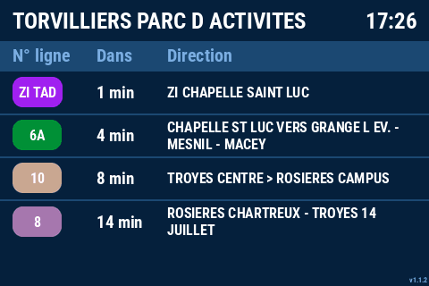

# AbribusDisplay

[](https://github.com/v-gael/AbribusDisplay/actions/workflows/check.yml)
[](LICENSE)

Un panneau « prochains passages » de bus, façon abribus, sur un Raspberry Pi
équipé d'un petit écran 3,5". Python génère l'image du panneau et l'affiche
directement sur le framebuffer de l'écran, sans environnement graphique.

<p align="center">
  
</p>

<p align="center"><sub>Rendu réel, généré depuis <code>docs/demo.json</code> : le panneau passe d'un arrêt à l'autre.</sub></p>

## En bref

- Récupère les prochains passages depuis une API (mon backend Symfony /
  API Platform, dépôt bientôt public) et les affiche arrêt par arrêt, en
  rotation.
- Tourne en continu sur un Raspberry Pi 3B+, dans Docker.
- Se développe sans le matériel : un mode « fichier » écrit l'image sur
  disque, visible dans le navigateur.

## Points techniques

- **Récupération et rendu découplés** : deux threads autour d'un état partagé
  protégé par un verrou. Un appel réseau lent ne bloque jamais le
  rafraîchissement de l'écran.
- **Tolérance aux coupures réseau** : si un appel échoue, les dernières
  données valides restent affichées avec un pictogramme discret. L'écran
  d'erreur n'apparaît que si aucune donnée n'a jamais été reçue.
- **Affichage sans clignotement** : l'image est écrite de façon atomique
  (fichier temporaire puis renommage), et `fbi` la recharge sur signal
  `SIGUSR1` au lieu d'être relancé.
- **Décompte calculé localement** : le « Dans X min » est recalculé à chaque
  rendu à partir de l'heure prévue, alors que l'API n'est interrogée
  qu'une fois par minute (par défaut).
- **Déploiement adapté au Pi** : l'image Docker est construite sur le Mac puis
  transférée par SSH (`make deploy`), sans aucune compilation sur le Pi. Un
  script idempotent prépare l'écran SPI sur un Pi neuf.
- **Qualité** : typage `mypy --strict`, lint et formatage `ruff`, CI GitHub
  Actions. Les rendus sont vérifiés visuellement à partir de JSON de
  référence (`make render-test`), et le GIF ci-dessus est produit par le même
  code.

## Stack

Python 3.11 · Pillow · requests · Docker · Raspberry Pi OS · `fbi` · GitHub Actions

## Essayer

Sans API ni Raspberry Pi, pour voir le rendu à partir des exemples :

```bash
git clone https://github.com/v-gael/AbribusDisplay.git
cd AbribusDisplay
make render-test   # génère des aperçus PNG dans output/
```

Avec une API : renseigner `API_URL` (et `TOKEN` si besoin) dans un fichier
`.env.local`, puis `make dev` et ouvrir `debug.html` dans le navigateur.

## Documentation

- [Documentation technique](docs/guide.md) : architecture, cas d'affichage,
  configuration, développement, déploiement sur le Pi, Makefile.
- [Contrat d'API](docs/api.md) : format des données attendues.

## Crédits et licence

Code sous licence [MIT](LICENSE).

- Police **Roboto Condensed Bold** : SIL Open Font License 1.1, voir
  [`assets/fonts/`](assets/fonts/).
- Icônes générées par IA pour ce projet : `assets/no_bus.png` avec ChatGPT
  (OpenAI), `assets/no_signal.png` avec Claude (Anthropic). Les conditions
  des deux services cèdent les droits sur les contenus générés : elles sont
  distribuées sous licence MIT avec le code.
- Noms d'arrêts, lignes et couleurs des exemples : données ouvertes du réseau
  TCAT (Troyes Champagne Métropole), publiées sur
  [transport.data.gouv.fr](https://transport.data.gouv.fr/datasets/donnees-tcat-troyes-champagne-metropole-1)
  sous licence [ODbL](https://opendatacommons.org/licenses/odbl/1.0/).

---

Projet personnel, développé pour mon propre usage : les contributions ne sont
pas attendues. Pour signaler une faille de sécurité, voir
[SECURITY.md](SECURITY.md).
