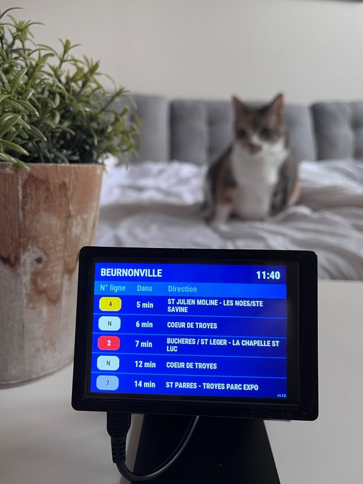
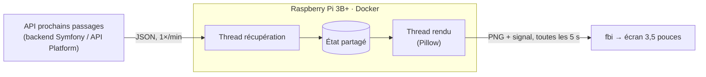

# AbribusDisplay

[](https://github.com/v-gael/AbribusDisplay/actions/workflows/check.yml)
[](LICENSE)
[](https://github.com/v-gael/AbribusDisplay/releases/latest)
[](https://www.python.org/)
[](https://mypy-lang.org/)
[](#matériel)

Un panneau « prochains passages » de bus, façon abribus, sur un Raspberry Pi
avec un écran 3,5". Python génère l'image et l'affiche directement sur le
framebuffer, sans environnement graphique.

<p align="center">
  
  
</p>

<p align="center"><sub>À gauche, le rendu généré depuis <code>docs/demo.json</code>. À droite, l'afficheur en situation.</sub></p>

## Fonctionnement



Le backend qui fournit les données est un projet séparé (dépôt bientôt
public). Le format attendu est décrit dans le [contrat d'API](docs/api.md).

## Points techniques

- **Récupération et rendu découplés** : deux threads, un appel réseau lent ne fige jamais l'écran.
- **Tolérance aux coupures** : les dernières données restent affichées, avec un pictogramme discret.
- **Sans clignotement** : écriture atomique de l'image, rechargée par `fbi` sur signal.
- **Déploiement léger** : image Docker construite sur le Mac et transférée par SSH (`make deploy`).
- **Qualité** : `mypy --strict`, `ruff`, CI GitHub Actions, rendus vérifiés sur des JSON de référence.

## Matériel

- Raspberry Pi 3B+
- Écran tactile SPI 3,5" 320×480 avec boîtier ([celui utilisé](https://www.amazon.fr/dp/B07NTH1JWH)) : tout clone Waveshare 3,5" (A) convient. [`setup-ecran-pi.sh`](setup-ecran-pi.sh) le configure sur un Pi neuf.

## Essayer

Sans API ni Raspberry Pi :

```bash
git clone https://github.com/v-gael/AbribusDisplay.git && cd AbribusDisplay
make render-test   # génère des aperçus PNG dans output/
```

Tout le reste (configuration, développement, déploiement sur le Pi) est dans la
[documentation technique](docs/guide.md).

## Crédits et licence

Code sous licence [MIT](LICENSE). Police Roboto Condensed (OFL 1.1), icônes
générées par IA, données d'exemple du réseau TCAT (ODbL) : détails dans les
[crédits](docs/guide.md#crédits).

---

<sub>Projet personnel, développé pour mon propre usage : les contributions ne sont pas attendues. Faille de sécurité : voir [SECURITY.md](SECURITY.md).</sub>
